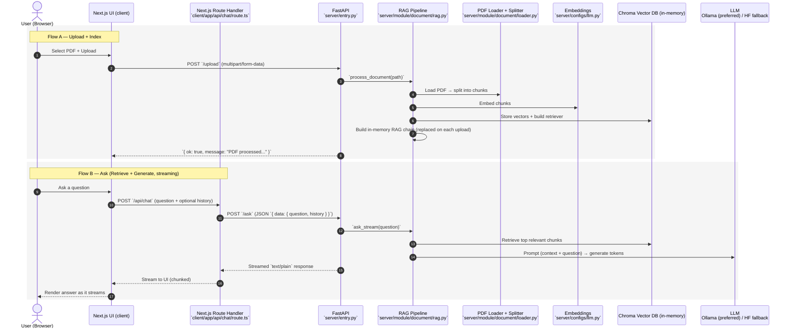

# PDF Upload AI App (QABot)

PDF upload + RAG Q&A app (local embeddings + Ollama/HF fallback).

## Structure

- **server/** — FastAPI backend: PDF upload, embed, RAG, streaming `/ask`
- **client/** — Next.js frontend: single page with upload + chat (neomorphic UI)

---

## Architecture (RAG data flow)

The system has two main flows: **PDF upload/indexing** and **question answering (retrieve + generate)**.



For a prioritized list of improvements and advanced RAG features, see **[RAG Improvements & Feature Ideas](./RAG_IMPROVEMENTS.md)**.

## Quick Start Guide

### Step 1: Prerequisites

Make sure you have installed:
- [Docker](https://www.docker.com/get-started) and Docker Compose
- (Optional) [Ollama](https://ollama.ai/) for better AI responses

### Step 2: Clone/Navigate to Project

```bash
cd qabot
```

### Step 3: Start Development Environment

**For development with hot-reload (recommended for coding):**

```bash
docker compose -f docker-compose.dev.yml up --build
```

**For production deployment:**

```bash
docker compose up --build
```

### Step 4: Wait for Services to Start

You'll see output like:
```
✓ Server running on http://0.0.0.0:8000
✓ Client ready on http://localhost:3005
```

### Step 5: Access the Application

- **Frontend UI:** Open http://localhost:3005 in your browser
- **Backend API:** Available at http://localhost:8000

### Step 6: Start Developing

1. **Make changes** to any file in `client/` or `server/`
2. **Save the file**
3. **See changes instantly** - no rebuild needed!

### Step 7: Stop Services

When you're done:

```bash
# For development mode
docker compose -f docker-compose.dev.yml down

# For production mode
docker compose down
```

---

## Run with Docker

### Production Mode (recommended for deployment)

**Step-by-step setup for production:**

1. **Navigate to project directory:**
   ```bash
   cd qabot
   ```

2. **Build and start containers:**
   ```bash
   docker compose up --build
   ```

3. **Wait for build to complete:**
   - Docker builds optimized production images
   - Installs dependencies
   - Compiles Next.js application

4. **Access the application:**
   - **Frontend:** http://localhost:3005  
   - **Backend API:** http://localhost:8000  

5. **Run in background (optional):**
   ```bash
   docker compose up --build -d
   ```

6. **Stop containers:**
   ```bash
   docker compose down
   ```

**Note:** Production mode builds static assets. Code changes require rebuilding containers.

### Development Mode (with hot-reload)

**Step-by-step setup for development:**

1. **Navigate to project directory:**
   ```bash
   cd qabot
   ```

2. **Start development containers:**
   ```bash
   docker compose -f docker-compose.dev.yml up --build
   ```

3. **Wait for build to complete** (first time only):
   - Docker will download base images
   - Install npm packages for client
   - Install Python packages for server
   - This may take a few minutes

4. **Verify services are running:**
   - Look for "Ready" messages in the terminal
   - Frontend: http://localhost:3005
   - Backend: http://localhost:8000

5. **Start coding:**
   - Edit files in `client/` or `server/`
   - Save changes
   - Changes appear automatically!

**Features:**
- ✅ **Hot-reload**: Changes to client code automatically refresh in the browser
- ✅ **Auto-reload**: Changes to server code automatically restart the server
- ✅ **Volume mounts**: Source code is mounted, so changes are reflected immediately
- ✅ **No rebuild needed**: Just save your files and see changes instantly

**Common Commands:**

```bash
# Start development (first time or after adding dependencies)
docker compose -f docker-compose.dev.yml up --build

# Start development (after initial setup)
docker compose -f docker-compose.dev.yml up

# Start in background
docker compose -f docker-compose.dev.yml up -d

# View logs
docker compose -f docker-compose.dev.yml logs -f

# View logs for specific service
docker compose -f docker-compose.dev.yml logs -f client
docker compose -f docker-compose.dev.yml logs -f server

# Restart containers
docker compose -f docker-compose.dev.yml restart

# Stop containers
docker compose -f docker-compose.dev.yml down
```

**When to Rebuild:**
- ✅ First time setup
- ✅ After adding new npm packages (`client/package.json`)
- ✅ After adding new Python packages (`server/requirements.txt`)
- ✅ After modifying Dockerfiles
- ❌ **NOT needed** for regular code changes

**Troubleshooting:**

| Issue | Solution |
|-------|----------|
| Changes not reflecting | Restart: `docker compose -f docker-compose.dev.yml restart` |
| Port already in use | Stop other services on ports 3005/8000 or change ports in `docker-compose.dev.yml` |
| Build errors | Check logs: `docker compose -f docker-compose.dev.yml logs` |
| Container won't start | Rebuild: `docker compose -f docker-compose.dev.yml up --build` |
| Node modules issues | Rebuild client: `docker compose -f docker-compose.dev.yml build client` |
| Python dependencies issues | Rebuild server: `docker compose -f docker-compose.dev.yml build server` |

---

## Run without Docker

### 1. Backend (from `server/`)

```bash
cd server
pip install -r requirements.txt
uvicorn entry:app --reload --host 0.0.0.0 --port 8000
```

Must run from inside `server/` so `configs` and `module` resolve.

### 2. Frontend

```bash
cd client
npm install
npm run dev
```

Open http://localhost:3000. Set `NEXT_PUBLIC_API_URL=http://localhost:8000` if the API is elsewhere.

### 3. Optional: Ollama

For best answers, run Ollama and pull a model:

```bash
ollama pull llama3.2
```

Without Ollama, the app falls back to a small Hugging Face model (CPU).

---

## API

- `GET /` — Health
- `POST /upload` — `multipart/form-data` with `file` (PDF)
- `POST /ask` — JSON `{ "data": { "question": "..." } }` → streaming text/plain

---

## Quick Reference

### Development vs Production

| Feature | Development Mode | Production Mode |
|---------|-----------------|-----------------|
| **Command** | `docker compose -f docker-compose.dev.yml up` | `docker compose up` |
| **Hot-reload** | ✅ Yes | ❌ No |
| **Build time** | Faster (dev mode) | Slower (optimized) |
| **Code changes** | Instant (no rebuild) | Requires rebuild |
| **Use case** | Development & testing | Deployment |
| **Ports** | 3005 (client), 8000 (server) | 3005 (client), 8000 (server) |

### File Changes Workflow

**Development Mode:**
```
1. Edit code → 2. Save file → 3. See changes instantly ✨
```

**Production Mode:**
```
1. Edit code → 2. Rebuild: `docker compose up --build` → 3. See changes
```

### Need More Help?

- **Detailed development guide:** See `DEVELOPMENT.md`
- **Project plan:** See `PLAN.md`
- **Docker issues:** Check logs with `docker compose logs -f`

---

